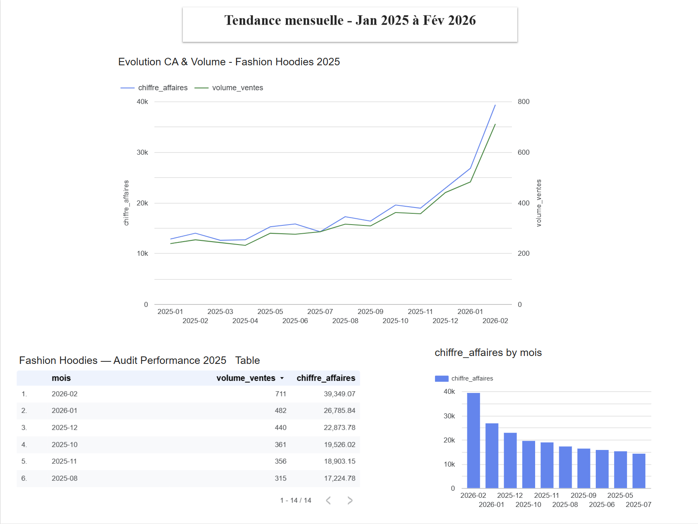

# Page 1 : Vue Macro (KPIs globaux)

┌─────────────────────────────────────────────────────────┐
│  🧥 FASHION HOODIES — AUDIT PERFORMANCE 2025            │
│  Jan 2025 → Fév 2026  |  bigquery-public-data.thelook   │
├──────────┬──────────┬──────────┬──────────┬─────────────┤
│  254k€   │  48%     │  4 657   │  4 434   │  55.91€     │
│  CA Brut │  Marge   │  Unités  │  Clients │  Panier moy │
├──────────┴──────────┴──────────┴──────────┴─────────────┤
│                                                         │
│  [Scorecard]  [Scorecard]  [Scorecard]  [Scorecard]     │
│   0.40         1 051j       0.6j         32.89%         │
│  Rotation     Stock rest.  Expédition   Abandon pan.    │
│                                                         │
├─────────────────────────────────────────────────────────┤
│  [Jauge] Taux de marge    [Jauge] Rotation stocks       │
│          0% ——— 48% ———100%        0 ——0.4—— 6          │
└─────────────────────────────────────────────────────────┘

