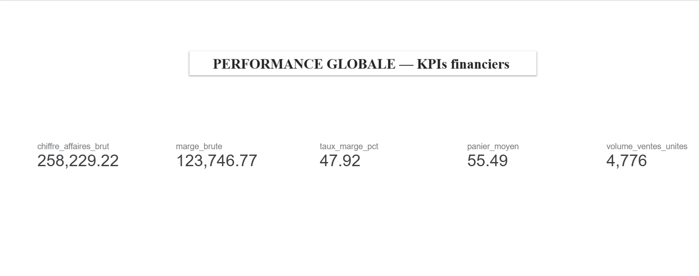

# Page 2 : Tendance et performance 
┌─────────────────────────────────────────────────────────┐
│  📈 ÉVOLUTION MENSUELLE — CA & VOLUME                   │
├─────────────────────────────────────────────────────────┤
│                                                         │
│  [Graphique en courbes — double axe]                    │
│   Axe gauche : CA mensuel (€)                          │
│   Axe droit  : Volume ventes (unités)                  │
│   X          : Mois (Jan 2025 → Fév 2026)              │
│                                                         │
│   📊 Jan: 11 664€ / 206u → Oct: 18 863€ / 345u        │
│                                                         │
├──────────────────────┬──────────────────────────────────┤
│  [Barres groupées]   │  [Tableau]                       │
│  Marge brute/mois    │  Mois | CA | Volume | Tx Marge  │
│                      │  Jan  | .. | ..     | ..        │
│                      │  Fév  | .. | ..     | ..        │
└──────────────────────┴──────────────────────────────────┘

