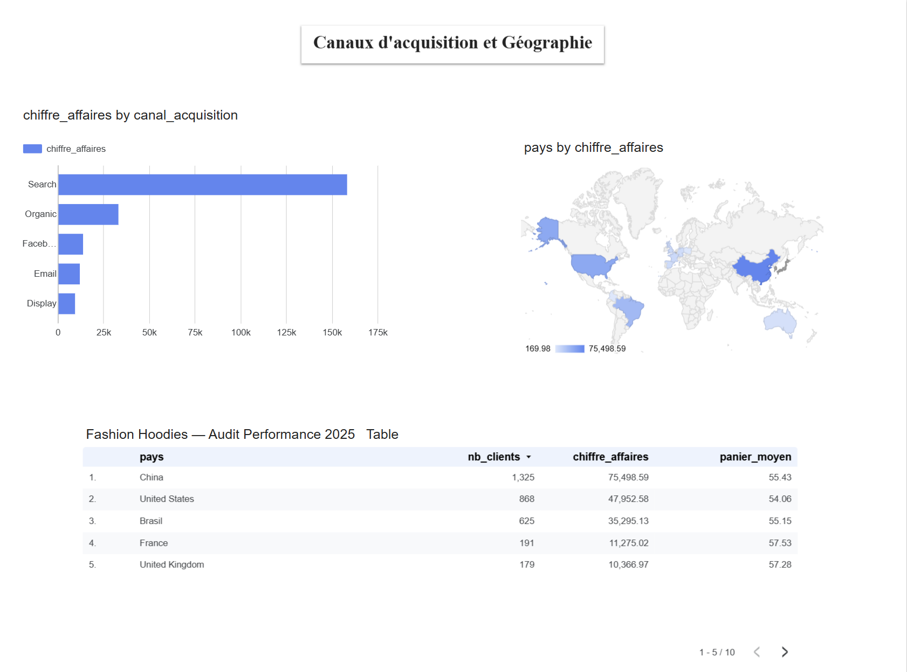

# Page 3 : Acquisition et Géographie 
┌─────────────────────────────────────────────────────────┐
│  🌍 MARCHÉS & CANAUX D'ACQUISITION                      │
├───────────────────────────┬─────────────────────────────┤
│  [Carte Géographique]     │  [Bar chart horizontal]     │
│                           │  TOP CANAUX par CA          │
│   🟠 Chine  33.4%         │                             │
│   🟡 USA    21.2%         │  Search  ████████ 69%      │
│   🟢 Brésil 15.6%         │  Organic ███ 15%           │
│   ...                     │  Facebook ██ 7%            │
│                           │  Email   █ 5%              │
├───────────────────────────┴─────────────────────────────┤
│  [Tableau] Top 13 pays                                  │
│  Pays | Clients | CA | Part CA% | Panier Moyen          │
│  China|  1 325  | 75k|  33.4%  |  55.02€              │
│  USA  |   868   | 47k|  21.2%  |  54.11€              │
├─────────────────────────────────────────────────────────┤
│  [Funnel chart] Tunnel de conversion                    │
│  Visiteurs → Accueil → Produit → Panier → Achat        │
│  43 731  →  41 072  → 166 363 → 125 748 → 84 391      │
└─────────────────────────────────────────────────────────┘

