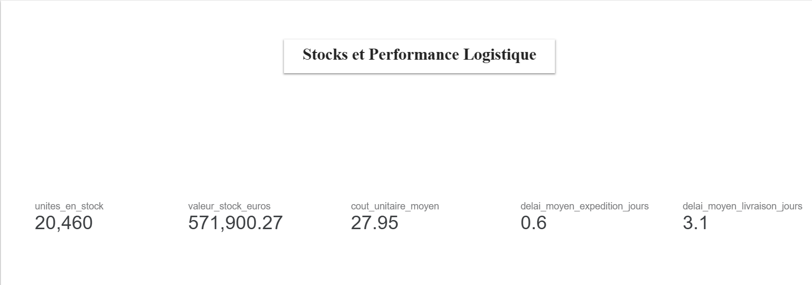

# Page 4 : Logistique et Stocks 
┌─────────────────────────────────────────────────────────┐
│  📦 PERFORMANCE LOGISTIQUE & STOCKS                     │
├──────────────────────────────┬──────────────────────────┤
│  [Scorecards logistique]     │  [Bullet chart]          │
│                              │  Délai expédition        │
│  0.6j      3.1j    0.07%     │  ████ 0.6j  (max: 4j)  │
│  Expédit.  Livr.   Retard    │                          │
│                              │  Délai livraison         │
│                              │  ████████ 3.1j (max:10j)│
├──────────────────────────────┴──────────────────────────┤
│  🚨 ALERTE STOCKS                                       │
├──────────────────────────────┬──────────────────────────┤
│  [Scorecard rouge]           │  [Jauge rouge]           │
│  564 122 €                   │  Rotation stocks         │
│  Valeur stock immobilisé     │  0 ——0.4—————— 6        │
│                              │     ⚠️ CRITIQUE          │
│  [Scorecard orange]          │                          │
│  1 051 jours                 │  [Comparaison barres]    │
│  Stock restant estimé        │  Stock: 564k€            │
│                              │  CA:    225k€            │
│  [Scorecard]                 │  → Stock = 2.5× le CA   │
│  19 950 unités               │                          │
│  En stock aujourd'hui        │                          │
└──────────────────────────────┴──────────────────────────┘

